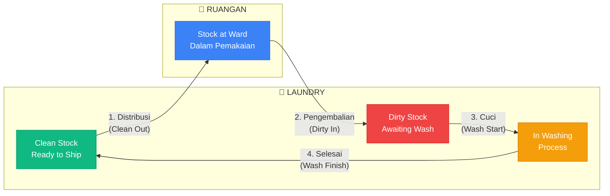
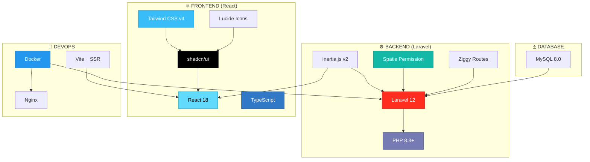
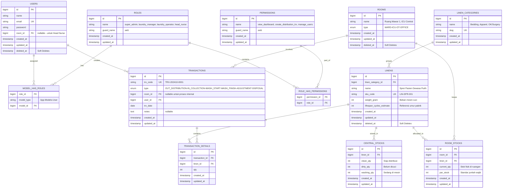
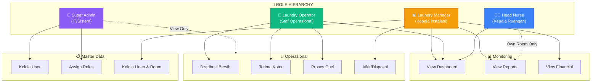
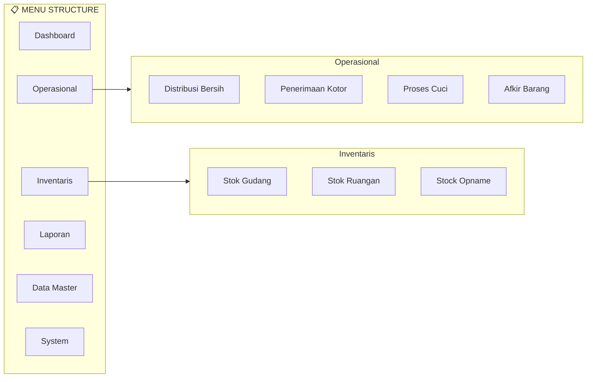
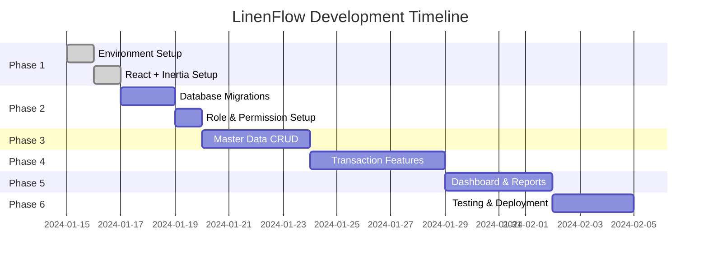

# 🏥 LinenFlow – Hospital Linen Management System

> **Product Requirement Document (PRD)**  
> Sistem Manajemen Linen Rumah Sakit berbasis Laravel + Inertia.js + React

---

## 📋 Daftar Isi

-   [Executive Summary](#-executive-summary)
-   [Problem Statement](#-problem-statement)
-   [Tujuan Aplikasi](#-tujuan-aplikasi)
-   [Alur Kerja (Business Logic)](#-alur-kerja-business-logic)
-   [Fitur Utama & Modul](#-fitur-utama--modul)
-   [Tech Stack](#-tech-stack)
-   [Project Structure](#-project-structure)
-   [Database Schema](#-database-schema)
-   [Role & Permission System](#-role--permission-system)
-   [Navigation & Menu Structure](#-navigation--menu-structure)
-   [Project Workflow](#-project-workflow)
-   [Development Roadmap](#-development-roadmap)
-   [Setup & Deployment](#-setup--deployment)
-   [Best Practices](#-best-practices--implementation-notes)

---

## 🎯 Executive Summary

Banyak orang IT fokus ke data medis, padahal **manajemen linen di RS besar** seperti Sanglah itu perputaran uangnya **miliaran rupiah** (pengadaan sprei, selimut, baju OK, jas dokter). Kalau hilang 10% saja per tahun, kerugiannya sangat besar.

**LinenFlow** hadir sebagai solusi untuk:

-   ✅ Mencegah kebocoran aset
-   ✅ Efisiensi operasional
-   ✅ Tracking real-time pergerakan linen

---

## 🔴 Problem Statement

RS tidak tahu posisi linen ada di mana. Pertanyaan yang sering muncul:

| Masalah            | Deskripsi                                          |
| ------------------ | -------------------------------------------------- |
| 📦 **Stok Habis**  | "Apakah stok habis karena masih kotor di laundry?" |
| 🕵️ **Stok Hilang** | "Apakah stok hilang dicuri di ruangan?"            |
| 🧵 **Stok Rusak**  | "Apakah stok rusak/sobek?"                         |

---

## 🎯 Tujuan Aplikasi

**Tracking pergerakan jumlah linen** dari:

```
Laundry (Bersih) → Distribusi ke Ruangan → Pemakaian → Pengembalian (Kotor) → Cuci
```

---

## 🔄 Alur Kerja (Business Logic)

Siklus pergerakan linen di rumah sakit:



### Detail Alur:

| Step | Nama                        | Deskripsi                                                       | Efek pada Stok       |
| ---- | --------------------------- | --------------------------------------------------------------- | -------------------- |
| 1️⃣   | **Distribusi (Clean Out)**  | Petugas Laundry mencatat pengiriman linen bersih ke Ruang Rawat | Gudang ⬇️ Ruangan ⬆️ |
| 2️⃣   | **Pemakaian**               | Ruangan menyimpan stok tersebut (Stock at Ward)                 | -                    |
| 3️⃣   | **Pengembalian (Dirty In)** | Petugas mengambil linen kotor dari Ruangan ke Laundry           | Ruangan ⬇️ Kotor ⬆️  |
| 4️⃣   | **Pencucian (Process)**     | Linen dicuci (Status: In Washing)                               | Kotor ⬇️ Washing ⬆️  |
| 5️⃣   | **Restock (Clean In)**      | Selesai cuci, setrika, lipat → Gudang Laundry                   | Washing ⬇️ Bersih ⬆️ |

---

## 🧩 Fitur Utama & Modul

### A. Modul Master Data

#### 1. Jenis Linen

| Field           | Deskripsi                             | Contoh                                    |
| --------------- | ------------------------------------- | ----------------------------------------- |
| Nama            | Nama jenis linen                      | Sprei Besar, Sarung Bantal, Selimut Lurik |
| Standar Berat   | Berat dalam gram                      | Penting untuk kapasitas mesin cuci        |
| SKU Code        | Kode unik item                        | LIN-SPR-001                               |
| Lifespan Cycles | Estimasi umur cuci (referensi pabrik) | 100 kali cuci                             |

> [!NOTE] > **Catatan tentang Lifespan Cycles**: Karena sistem ini menggunakan **Bulk Tracking** (jumlah) dan bukan **Item Tracking** (per lembar pakai RFID/Barcode unik), tidak dapat melacak umur sprei secara spesifik. Kolom `lifespan_cycles` disimpan sebagai data referensi untuk estimasi turnover rate.

#### 2. Ruangan (Unit)

| Field                     | Deskripsi            | Contoh                |
| ------------------------- | -------------------- | --------------------- |
| Nama Ruangan              | Lokasi di RS         | IGD, ICU, Mawar       |
| Tipe                      | Kategori ruangan     | WARD, ICU, OT, OFFICE |
| Kuota Standar (Par Stock) | Jumlah wajib standby | ICU: 100 sprei        |

---

### B. Modul Transaksi (The Heart) ❤️

#### 1. Distribusi Linen Bersih

```
📝 Form Input Bulk (Multiple Items) - React Component
├── Pilih Ruangan → List Item & Jumlah
├── Effect: Stok Gudang Laundry ⬇️
└── Effect: Stok Ruangan ⬆️
```

#### 2. Penerimaan Linen Kotor

```
📝 Form Input
├── Pilih Ruangan → List Item & Jumlah (atau Berat total)
├── Effect: Stok Ruangan ⬇️
└── Effect: Stok Kotor Laundry ⬆️
```

#### 3. Afkir (Pemusnahan/Disposal)

```
📝 Mencatat linen rusak
├── Linen sobek/bernoda permanen
├── Membutuhkan approval dari Manager
└── Effect: Mengurangi total aset RS
```

---

### C. Modul Monitoring (Dashboard)

#### 1. Lost & Found Tracker

Selisih antara **"Dikirim Bersih"** vs **"Diterima Kotor"**

```
📊 Logic Example:
├── Kirim bulan ini: 1000 sprei ke IGD
├── Kembali kotor: 950 sprei
├── Sisa di lemari IGD: 20 sprei
└── ⚠️ HILANG: 30 sprei
```

#### 2. Par Level Alert

🔔 Notifikasi jika stok bersih di bawah batas aman

---

## 🛠️ Tech Stack

Teknologi **modern SPA** untuk UI/UX premium dan interaktivitas tinggi:



### Detail Tech Stack:

| Layer          | Technology        | Version | Kegunaan                              |
| -------------- | ----------------- | ------- | ------------------------------------- |
| **Runtime**    | PHP               | 8.5+    | Native type declarations, performance |
| **Framework**  | Laravel           | 12.47   | Backend API & Authentication          |
| **Bridge**     | Inertia.js        | 2.x     | SPA tanpa API terpisah                |
| **Permission** | Spatie Permission | 6.24    | Dynamic Role & Permission Management  |
| **Frontend**   | React             | 18.x    | Component-based UI                    |
| **Language**   | TypeScript        | 5.x     | Type safety                           |
| **UI Library** | shadcn/ui         | Latest  | Beautiful, accessible components      |
| **Styling**    | Tailwind CSS      | 4.x     | Utility-first CSS                     |
| **Icons**      | Lucide React      | Latest  | Beautiful, consistent icons           |
| **Routing**    | Ziggy             | 2.x     | Laravel routes in JavaScript          |
| **Build**      | Vite              | 6.x     | Fast HMR & SSR support                |
| **Database**   | MySQL / MariaDB   | 8.0+    | Reliable RDBMS                        |
| **Container**  | Docker            | Latest  | Containerization & deployment         |

### Keuntungan Stack Ini:

| Keuntungan                   | Deskripsi                                                 |
| ---------------------------- | --------------------------------------------------------- |
| 🎨 **Native shadcn/ui**      | `npx shadcn add table` langsung jalan tanpa porting       |
| ⚡ **Fast State Management** | Bulk Input array berjalan di client-side React            |
| 📦 **Rich JS Ecosystem**     | react-qr-reader, recharts, chart.js langsung terintegrasi |
| 🚀 **SPA Experience**        | Pindah halaman tanpa reload browser                       |
| 🔒 **Type Safety**           | TypeScript mencegah runtime errors                        |
| 🖥️ **SSR Support**           | SEO-friendly dengan server-side rendering                 |

---

## 📁 Project Structure

```
linenflow-ngoerah/
├── app/                          # Laravel Backend
│   ├── Http/
│   │   ├── Controllers/          # Inertia Controllers
│   │   ├── Middleware/           # Auth, Permission middleware
│   │   └── Requests/             # Form Requests
│   ├── Models/                   # Eloquent Models
│   └── Services/                 # Business Logic Services
│
├── resources/
│   ├── js/                       # React Frontend
│   │   ├── components/           # React Components
│   │   │   ├── ui/               # shadcn/ui components
│   │   │   │   ├── button.tsx
│   │   │   │   ├── card.tsx
│   │   │   │   ├── sidebar.tsx
│   │   │   │   └── ...
│   │   │   ├── ApplicationLogo.tsx
│   │   │   └── ...
│   │   ├── Layouts/              # Page Layouts
│   │   │   ├── AuthenticatedLayout.tsx
│   │   │   └── GuestLayout.tsx
│   │   ├── Pages/                # Inertia Pages
│   │   │   ├── Auth/             # Login, Register, etc
│   │   │   ├── Dashboard.tsx
│   │   │   ├── Profile/
│   │   │   ├── Transactions/     # (To be created)
│   │   │   ├── Inventory/        # (To be created)
│   │   │   └── Master/           # (To be created)
│   │   ├── hooks/                # Custom React Hooks
│   │   ├── lib/                  # Utilities (cn, etc)
│   │   ├── types/                # TypeScript Types
│   │   ├── app.tsx               # React Entry Point
│   │   └── ssr.tsx               # SSR Entry Point
│   ├── css/
│   │   └── app.css               # Tailwind + shadcn CSS vars
│   └── views/
│       └── app.blade.php         # Root Blade Template
│
├── routes/
│   ├── web.php                   # Web Routes (Inertia)
│   └── auth.php                  # Auth Routes
│
├── database/
│   ├── migrations/               # Database Migrations
│   └── seeders/                  # Role & Permission Seeders
│
├── config/
│   ├── permission.php            # Spatie Permission config
│   └── ...
│
├── docs/                         # Documentation
│   ├── PRD.md                    # This file
│   └── catatan-revisi.txt
│
├── docker/                       # Docker Configuration
│   ├── nginx/
│   ├── php/
│   └── mysql/
│
├── components.json               # shadcn/ui configuration
├── tailwind.config.js            # Tailwind configuration
├── tsconfig.json                 # TypeScript configuration
├── vite.config.js                # Vite configuration
├── .npmrc                        # NPM configuration
├── docker-compose.yml            # Docker Compose
└── ...
```

### Key Directories:

| Directory                     | Purpose                                    |
| ----------------------------- | ------------------------------------------ |
| `resources/js/components/ui/` | shadcn/ui components                       |
| `resources/js/Pages/`         | Inertia page components                    |
| `resources/js/Layouts/`       | Shared layout components                   |
| `app/Services/`               | Business logic (LinenMovementService, etc) |
| `app/Http/Controllers/`       | Inertia controllers                        |

---

## 🗄️ Database Schema

### Entity Relationship Diagram



### Migration Files

<details>
<summary>📁 Click to expand Migration Code</summary>

#### 1. linen_categories

```php
Schema::create('linen_categories', function (Blueprint $table) {
    $table->id();
    $table->string('name');
    $table->string('slug')->unique();
    $table->timestamps();
});
```

#### 2. linens (dengan Soft Deletes)

```php
Schema::create('linens', function (Blueprint $table) {
    $table->id();
    $table->foreignId('linen_category_id')->constrained();
    $table->string('name');
    $table->string('sku_code')->unique();
    $table->integer('weight_gram')->default(0);
    $table->integer('lifespan_cycles_estimate')->default(100);
    $table->timestamps();
    $table->softDeletes();
});
```

#### 3. rooms (dengan Soft Deletes)

```php
Schema::create('rooms', function (Blueprint $table) {
    $table->id();
    $table->string('name');
    $table->enum('type', ['WARD', 'ICU', 'OT', 'OFFICE']);
    $table->timestamps();
    $table->softDeletes();
});
```

#### 4. users (Extended)

```php
Schema::table('users', function (Blueprint $table) {
    $table->foreignId('room_id')->nullable()->constrained();
    $table->softDeletes();
});
```

#### 5. central_stocks

```php
Schema::create('central_stocks', function (Blueprint $table) {
    $table->id();
    $table->foreignId('linen_id')->constrained();
    $table->unsignedInteger('clean_qty')->default(0);
    $table->unsignedInteger('dirty_qty')->default(0);
    $table->unsignedInteger('washing_qty')->default(0);
    $table->timestamps();
});
```

#### 6. room_stocks

```php
Schema::create('room_stocks', function (Blueprint $table) {
    $table->id();
    $table->foreignId('room_id')->constrained();
    $table->foreignId('linen_id')->constrained();
    $table->unsignedInteger('current_qty')->default(0);
    $table->unsignedInteger('par_stock')->default(0);
    $table->timestamps();
    $table->unique(['room_id', 'linen_id']);
});
```

#### 7. transactions

```php
Schema::create('transactions', function (Blueprint $table) {
    $table->id();
    $table->string('trx_code')->unique();
    $table->enum('type', [
        'OUT_DISTRIBUTION', 'IN_COLLECTION',
        'WASH_START', 'WASH_FINISH',
        'ADJUSTMENT', 'DISPOSAL'
    ]);
    $table->foreignId('room_id')->nullable()->constrained();
    $table->foreignId('user_id')->constrained();
    $table->date('trx_date');
    $table->text('notes')->nullable();
    $table->timestamps();
});
```

#### 8. transaction_details

```php
Schema::create('transaction_details', function (Blueprint $table) {
    $table->id();
    $table->foreignId('transaction_id')->constrained()->cascadeOnDelete();
    $table->foreignId('linen_id')->constrained();
    $table->integer('qty');
    $table->timestamps();
});
```

</details>

---

## 👥 Role & Permission System

Menggunakan **[spatie/laravel-permission](https://spatie.be/docs/laravel-permission)** untuk Dynamic Role Management.

### 4 Role Utama



### Detail Role & Permission

| Role                 | Persona          | Key Permissions                                                          |
| -------------------- | ---------------- | ------------------------------------------------------------------------ |
| **Super Admin**      | IT/Sistem        | `manage_users`, `assign_roles`, `view_*_menu` (View Only)                |
| **Laundry Manager**  | Kepala Instalasi | `manage_master_data`, `approve_disposal`, `view_financial_reports`       |
| **Laundry Operator** | Staf Operasional | `create_distribution_trx`, `create_collection_trx`, `create_washing_trx` |
| **Head Nurse**       | Kepala Ruangan   | `view_room_stock` (own room), `create_request`, `confirm_receipt`        |

### Permission Matrix (View vs Action)

| Fitur      | View Permission          | Action Permission         |
| ---------- | ------------------------ | ------------------------- |
| Distribusi | `view_distribution_menu` | `create_distribution_trx` |
| Penerimaan | `view_collection_menu`   | `create_collection_trx`   |
| Cuci       | `view_washing_menu`      | `create_washing_trx`      |
| Afkir      | `view_disposal_menu`     | `approve_disposal`        |

---

## 🧭 Navigation & Menu Structure

Menggunakan **shadcn/ui Sidebar** dengan permission-based rendering.



### React Sidebar Implementation

```tsx
// resources/js/components/AppSidebar.tsx
import { Sidebar, SidebarContent, SidebarMenu } from "@/components/ui/sidebar";
import { usePage } from "@inertiajs/react";

export function AppSidebar() {
    const { auth } = usePage().props;

    return (
        <Sidebar>
            <SidebarContent>
                <SidebarMenu>
                    {/* Permission-based menu items */}
                    {auth.permissions.includes("view_dashboard") && (
                        <Link href={route("dashboard")}>Dashboard</Link>
                    )}
                    {/* ... */}
                </SidebarMenu>
            </SidebarContent>
        </Sidebar>
    );
}
```

---

## 📅 Development Roadmap

### Phase Overview



### Detailed Roadmap Checklist

#### 🚀 Phase 1: Foundation ✅ COMPLETED

-   [x] **Environment Setup**

    -   [x] Verify PHP 8.5+, Composer, Node.js
    -   [x] Create Laravel 12 project
    -   [x] Setup Git repository

-   [x] **React + Inertia Setup**
    -   [x] Install Laravel Breeze (React + TypeScript + SSR)
    -   [x] Install shadcn/ui
    -   [x] Install Spatie Permission
    -   [x] Configure Tailwind CSS

---

#### 📦 Phase 2: Database & Permissions

-   [ ] **Database Migrations**

    -   [ ] Create `linen_categories` migration
    -   [ ] Create `linens` migration (with SoftDeletes)
    -   [ ] Create `rooms` migration (with SoftDeletes)
    -   [ ] Create `central_stocks` migration
    -   [ ] Create `room_stocks` migration
    -   [ ] Create `transactions` migration
    -   [ ] Create `transaction_details` migration
    -   [ ] Update `users` migration (room_id, SoftDeletes)

-   [ ] **Role & Permission Setup**
    -   [ ] Create RoleSeeder (4 roles)
    -   [ ] Create PermissionSeeder (all permissions)
    -   [ ] Assign permissions to roles
    -   [ ] Setup middleware

---

#### 📋 Phase 3: Master Data CRUD

-   [ ] **React Components**

    -   [ ] LinenCategoryPage (List, Create, Edit)
    -   [ ] LinenPage (List, Create, Edit)
    -   [ ] RoomPage (List, Create, Edit)
    -   [ ] UserPage (List, Create, Edit, Assign Role)

-   [ ] **Inertia Controllers**
    -   [ ] LinenCategoryController
    -   [ ] LinenController
    -   [ ] RoomController
    -   [ ] UserController

---

#### 💼 Phase 4: Transaction Features

-   [ ] **Distribution (Distribusi Bersih)**

    -   [ ] Bulk input form with React state
    -   [ ] Stock validation
    -   [ ] LinenMovementService

-   [ ] **Collection (Penerimaan Kotor)**

    -   [ ] Room stock display
    -   [ ] Bulk input

-   [ ] **Washing Process**

    -   [ ] Start/Finish wash
    -   [ ] Stock mutation

-   [ ] **Disposal (Afkir)**
    -   [ ] Approval workflow
    -   [ ] Asset reduction

---

#### 📊 Phase 5: Dashboard & Reports

-   [ ] **Dashboard**

    -   [ ] Stock overview widgets
    -   [ ] Charts (recharts)
    -   [ ] Par level alerts

-   [ ] **Reports**
    -   [ ] Transaction log
    -   [ ] Lost & Found analysis
    -   [ ] Export PDF/Excel

---

#### 🧪 Phase 6: Testing & Deployment

-   [ ] **Testing**

    -   [ ] Feature tests
    -   [ ] Permission tests

-   [ ] **Docker Setup**
    -   [ ] Dockerfile
    -   [ ] docker-compose.yml
    -   [ ] Nginx config

---

## 🐳 Setup & Deployment

### Prerequisites

```bash
PHP >= 8.5
Composer >= 2.6
Node.js >= 24
Docker Desktop
MySQL 8.0
Git
```

### Local Development

```bash
# Clone & Install
git clone https://github.com/Akfiss/linenflow-ngoerah.git
cd linenflow-ngoerah
composer install
npm install

# Setup
cp .env.example .env
php artisan key:generate
php artisan migrate

# Development
npm run dev
php artisan serve
```

### Docker Deployment

```yaml
# docker-compose.yml
version: "3.8"
services:
    app:
        build: ./docker/php
        volumes:
            - ./:/var/www
    webserver:
        image: nginx:alpine
        ports:
            - "80:80"
    db:
        image: mysql:8.0
        environment:
            MYSQL_DATABASE: linenflow
```

---

## 💡 Best Practices & Implementation Notes

### 1. Inertia.js Patterns

```tsx
// Controller returns Inertia response
return Inertia::render('Transactions/Distribution', [
    'rooms' => Room::all(),
    'linens' => Linen::with('category')->get(),
]);

// React page receives props with types
interface Props {
  rooms: Room[];
  linens: Linen[];
}

export default function Distribution({ rooms, linens }: Props) {
  // ...
}
```

### 2. Permission Check in React

```tsx
import { usePage } from "@inertiajs/react";

export function ActionButton() {
    const { permissions } = usePage().props.auth;

    if (!permissions.includes("create_distribution_trx")) {
        return <Button disabled>Read Only</Button>;
    }

    return <Button>Submit</Button>;
}
```

### 3. Bulk Input with React State

```tsx
const [items, setItems] = useState<LineItem[]>([{ linen_id: "", qty: 1 }]);

const addRow = () => {
    setItems([...items, { linen_id: "", qty: 1 }]);
};
```

---

## 📝 Notes

> [!IMPORTANT] > **Soft Deletes Wajib**: Data tidak boleh dihapus permanen untuk audit.

> [!TIP]
> Gunakan **shadcn/ui** untuk konsistensi UI: `npx shadcn add [component]`

> [!WARNING]
> Backend permission check tetap wajib meski UI sudah hidden.

---

**Created with ❤️ for RSUP Prof. I.G.N.G. Ngoerah**
